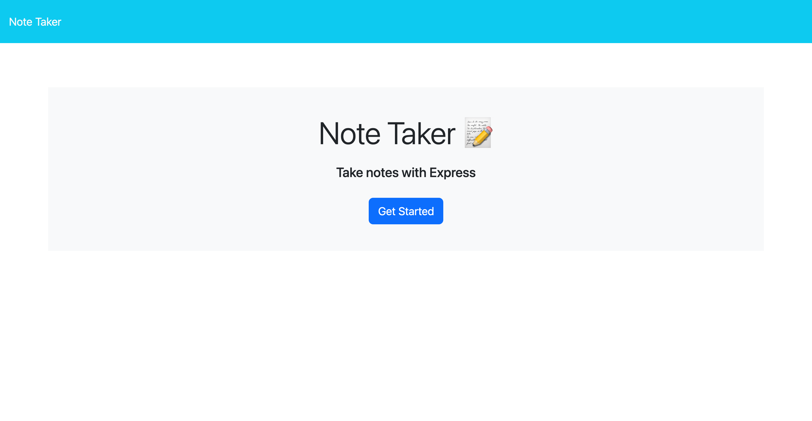

# Notes-App

  

[Live Link](https://peaceful-wildwood-60803-3319c65e5cea.herokuapp.com/)

## Table of Contents
- [Description](#description)
- [Usage](#usage)
- [License](#license)
- [Questions](#questions)

## Description

      
This notes application served as a practical exercise for gaining hands-on experience in developing APIs with Express.js. It was primarily constructed based on reference code, accessible through the provided link. Moving forward, the plan includes implementing delete functionality within the app and refactoring the file structure to enhance modularity and organization.

## Usage
  
Simply add a note title and note description.  The save button will appear at the top of the screen once both parts of the form have been filled.  

## License
[MIT](https://opensource.org/licenses/MIT)

This project is licensed under the MIT license.

